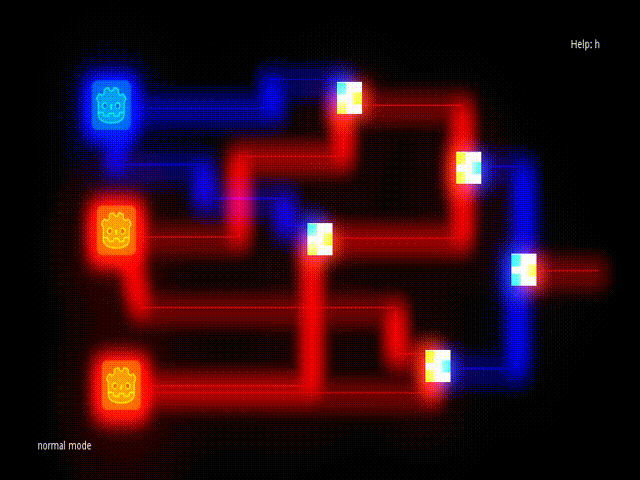

# Example

    

<!--[Project information](#project-info)-->
## Introduction
A simple logic gate simulator in Godot Version 3.5.

The Browser version can be used on  [https://aki78.itch.io/gdlogic](https://aki78.itch.io/gdlogic){:target="_blank"} , however, the save option currently might not work.

## Key Bindings
You must be in normal mode in order to switch to different modes

* normal mode: esc, q or right\_click
* wire mode: (draw wires) w
* switch mode: (add bit switches) b
* input mode: (change logic type) i
* help mode: (help screen) h
* gate mode: (add logic gate) l
* delete mode: (delete components) x, d or delete\_key
* rotate mode: (rotate a gate) r
* save: ctrl+s
* go back to center: t
* save and quit: ZZ
* quit without saving: :q
* visual mode: (to select region) v

<!--[Back to top](#airport-heist)-->

<!--## Current State-->

<!--Our game and website are currently fully functional. -->
<!--Website features:-->

<!--* create a profile(stores user data in database)-->
<!--* log in and out of their profile(calls upon database)-->
<!--* compete against other users for the highest score(update player's info in the database)-->
<!--* view top ten highest scores(calls on database)-->
<!--* view a tutorial on how to play-->
<!--* view live weather in cities they may be flying to in the game-->
<!--* view details about development team and contact-->

<!--[Back to top](#airport-heist)-->

<!--## Vision-->

<!--### Backstory-->

<!--You are a master thief, captured by the Finnish authorities on the minor charge of jaywalking.-->
<!--They have no idea of your true genius though and neglect to watch over you properly.-->
<!--You make a daring, yet surprisingly easy escape from Jokela Prison and are now on the run!-->
<!--You need to get out of Finland A.S.A.P though as the finnish authorities will stop at nothing to bring you to justice.-->

<!--Due to your expert skills you are able to steal 5,000€ from the Alepa at Helsinki Airport and commandeer a small plane.-->
<!--The police, however, have been alerted of your activities and are hot on your tail.-->
<!--Make it to the extraction point in portugal before interpol finds you!-->

<!--### Setting-->

<!--Airport Heist is set in present-day Europe.-->

<!--### Objective-->

<!--Your mission is to get to your extraction team, who are waiting for you in portugal, so they can smuggle you out of the EU.-->

<!--[Back to top](#airport-heist)-->

<!--## Functional Requirements-->

<!--### How the game works-->

<!--Airport Heist is a single player game, where the main character aims to make it to the destination airport, before they are captured or their money runs out.-->

<!--The main character starts the game with 5000€. Each flight cost money based on how long the flight is. Money is equal -->
<!--to points, so when the player reaches portugal their score is equal to how much money they have left. In order to -->
<!--get more money, and therefore points, players may choose to steal.-->

<!--#### Travel-->

<!--The main character starts in Helsinki, Finland and must end up in Portugal. Due to the size of the plane's fuel tank-->
<!--flights are limited to 800km. Players are shown the airports, with-in their 800km travel range, on a map. They must-->
<!--decide their flight path themselves.-->

<!--#### Evading Capture-->

<!--Players can see in which city interpol is and must avoid flying to the same airport. Interpol moves from airport-->
<!--to airport at random and in real time. Players must make their decisions quickly. The game is over if interpol lands -->
<!--in the same airport as the player.-->

<!--#### Stealing -->

<!--Stealing is done after a player arrives at a new airport. By clicking on the current airport after arriving at it, the player starts a mini-game. -->

<!--By winning the mini game the player will win extra money. Interpol is still moving live as the user plays, so keep an eye on them.-->

<!--If the player loses the mini game, there will be no reward, but instead an extra interpol will appear. Each time the player loses a mini game, a new interpol will spawn. The more interpol moving around the hard it will be to get to your extraction point in portugal.-->

<!--[Back to top](#airport-heist)-->

<!--### Decision Tree-->

<!--The decision tree below show all possible decisions the player can make and the benefits of each.-->

<!--[Back to top](#airport-heist)-->

<!--### Project Diagram-->

<!--This diagram shows how our different files interact with each other. At the moment we are using Godot, a game-->
<!--engine to run our game, python to run our backend, react for our website and SQL to store the game's data.-->

<!--[Back to top](#airport-heist)-->

<!--## Quality Requirements-->

<!--#### Software 1 Preliminary Requirements-->

<!--All helper functions created were ran through pytest to ensure proper working order.-->
<!--The database was cut down, to remove a lot of unnecessary information and to make calling upon the database faster.-->

<!--#### Software 2 Final Requirements-->
<!--All API endpoints were tested with insomnia to insure proper working order. This means we learnt new software and got an idea of industry standard tecniques. React was used to improve future development options for our website. This was not a requirement but was something our team felt would be a great learning oppertunity. -->

<!--The biggest coding challenge we faced this period was getting our user login details working. This required coding from Python, React and SQL. And then connecting all this programs together. This challenge was again not a requirement but one we set for ourselves. -->

<!--All components of the game are uploaded to Python Anywhere server. This means our game is accessible to anyone anywhere. This also gave us a great understanding of how different systems interact with each other and what is possible with different servers. Many servers were tested, but failed due to compatibility issues.-->

## Further Development Plans

* Fully Programmable Gates
* Bundlable logic
* Better Graphics
* Saveable on browser version

<!--[Back to top](#airport-heist)-->

<!--## Project Info-->

<!--[Project Requirements GitHub](https://github.com/vesavvo/Python_Ohjelmistoteema/tree/main/English/Project)-->
